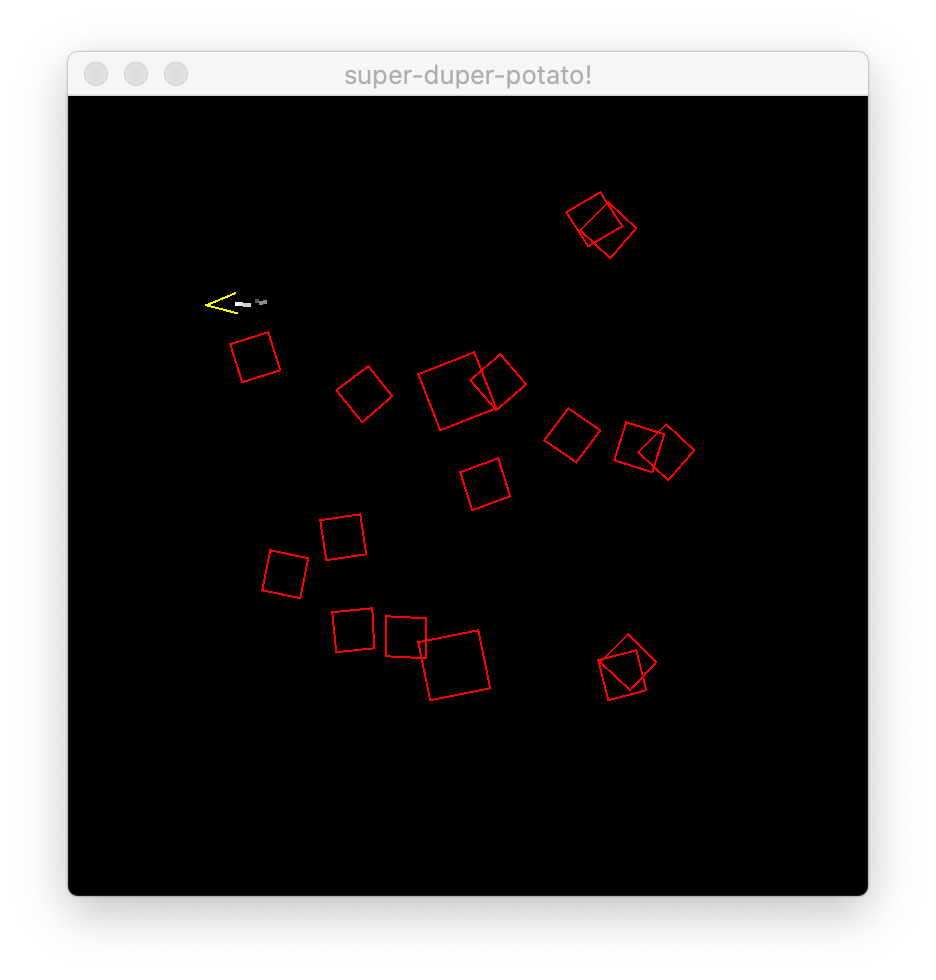

# super-duper-potato

Functional component entity system based "game engine". 
Implemented mostly working Asteroids -like game with it.

Full state of the game engine is in a single data structure.
Set of funtions to manage entities and systems mostly ensures that
there is a fast access to only to entities that a system needs to process.  

Code is mostly REPL friendly, so you can have affect game directly by 
evaluating functions. If that fails, then `clojure-ces.example.game/reset-world` 
should start using the code changes.




## Usage

Starts up Socket REPL in port localhost:

```
lein run
```

With uberjar:
```
lein uberjar
java -jar target/clojure-ces-0.1.0-SNAPSHOT-standalone.jar
```

## License

Copyright © 2019 Juha Syrjälä

<div>Icons made by <a href="https://www.flaticon.com/authors/freepik" title="Freepik">Freepik</a> from <a href="https://www.flaticon.com/"             title="Flaticon">www.flaticon.com</a></div>
